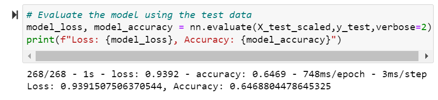
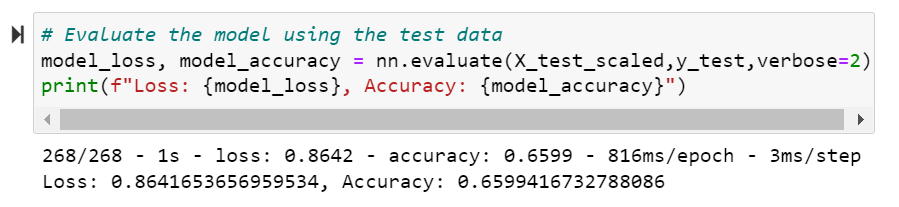
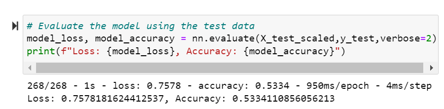
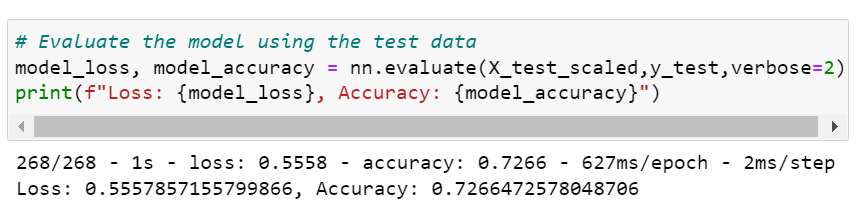

# Neural_Network_Charity_Analysis

## Project Overview
By using Machine Learning and Neural Networks and features of the dataset, I created a binary classifier that would help predict if the applicant will be successful. The data contains various measures across 34000 organizations that have been funded by the Charitable Organization, Alphabet Soup.
## Results
### Data Preprocessing
- The target variable for this model is IS_SUCCESSFUL column.
- The feature variables for this model are are all other variables aside from target variable and dropped columns.
- Other non-target and non-feature variables are EIN and NAME as they will have little to no impact on the outcome.

### Compiling, Training & Evaluating the Model
- I had 2 hidden layers and an output layer in the neural network model; the first layer with 80 neurons and the second with 30. The hidden layers both have the relu activation function, and the output layer has the sigmoid activation function.
- The model fell short of the 75% goal by 6% as it is only 65% accurate.

- In attempt 1 to increase model performance, I removed the USE_CASE column while keeping the rest of model the same. There was a slight increase from 65% to 66%

- In my next attempt, I added additional neurons to the hidden layers as well as added a third hidden layer. Unfortunately, this brought the accuracy down to 53%

- In my final attempt, I kept the hidden layers the same as attempt 2, but adjusted the number of epochs and neurons per layer. Luckily, this increased overall accuracy to 72%!

## Summary
The overall accuracy of the model was 72% which is just shy of the goal of 75%. In order to further optimize the neural network, the removal of more features or adding more data would be necessary. An alternate route we could have taken in the analysis here would be to use Random Forest Classifiers for their suffience number of estimators and tree depth. By using the random forest models, we could increase perforamnce speed and avoid the data being overfitted.
